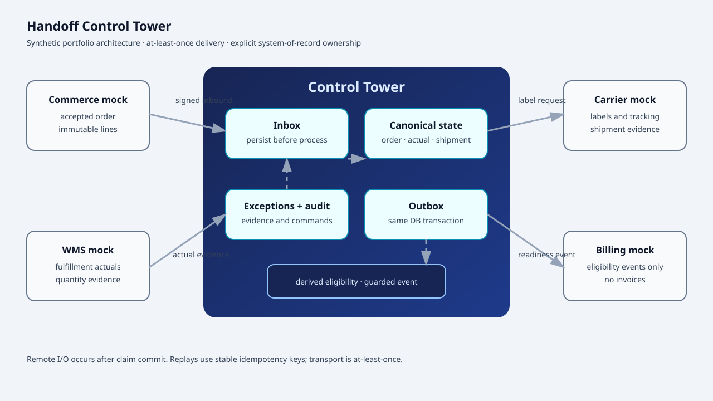

# Handoff Control Tower

Production-style reference implementation for reliable commerce → warehouse → carrier handoffs, with a guarded billing-readiness boundary.

The system demonstrates how to preserve business truth across asynchronous integrations:

```text
order accepted → warehouse released → picked / short-shipped → shipped
→ tracking synchronized → reconciled → invoice eligibility evaluated
```

This is a portfolio and engineering reference system, not a claim of live vendor connectivity or production deployment readiness. Every external integration is a deterministic synthetic mock. The project uses synthetic tenants, orders, SKUs, addresses, tracking references, and operator identities only.

## Status and disclosure

- Current implementation: M0–M11 complete; see [<code>docs/IMPLEMENTATION_STATUS.md</code>](docs/IMPLEMENTATION_STATUS.md).
- Stack: NestJS, strict TypeScript, Drizzle ORM, PostgreSQL, Redis, and pnpm workspaces.
- Delivery semantics: at-least-once delivery with idempotent effects. Exactly-once transport is not claimed.
- Billing boundary: emits guarded invoice-eligibility events only. It does not create accounting invoices, collect payments, or connect to an accounting product.
- External systems: commerce, warehouse, carrier, and billing interfaces are versioned ports with deterministic mocks. No proprietary WMS, TMS, carrier, commerce, or accounting API is implemented or implied.
- Runtime: Docker Compose is the portable local runtime contract. Native PostgreSQL and Redis are also supported for acceptance checks.

## What the system proves

Handoff Control Tower focuses on the failure modes that occur between systems rather than on vendor-specific API calls:

- duplicate and out-of-order inbound messages;
- durable inbound persistence before processing;
- transactional state changes and outbound messages;
- leased, retryable, dead-lettered outbox delivery;
- partial fulfillment and short-shipment handling;
- cancellation compensation after warehouse work has started;
- tenant isolation and optimistic operator concurrency;
- reconciliation of local state against authoritative external evidence;
- explicit exceptions, operator decisions, audit history, and correlation chains;
- conservative invoice-eligibility decisions based on operational evidence.

## Architecture



The architectural decisions are recorded in:

- [<code>ADR-001</code>](docs/adr/ADR-001-stack.md) — NestJS application shells, strict TypeScript, Drizzle, and PostgreSQL;
- [<code>ADR-002</code>](docs/adr/ADR-002-transactional-inbox-outbox.md) — transactional inbox/outbox, leases, retries, dead letters, and at-least-once delivery;
- [<code>ADR-003</code>](docs/adr/ADR-003-system-of-record-ownership.md) — authoritative ownership and explicit conflict evidence.

### System-of-record ownership

| Concern                                               | Authoritative source       | Control Tower responsibility                         |
| ----------------------------------------------------- | -------------------------- | ---------------------------------------------------- |
| Accepted order identity and lines                     | Commerce                   | Store an immutable canonical snapshot and revisions  |
| Allocation, pick, pack, short, and damaged quantities | Warehouse                  | Preserve fulfillment actuals and evidence            |
| Labels and tracking references                        | Carrier adapter            | Persist shipment evidence and synchronize references |
| Invoice eligibility                                   | Control Tower policy       | Derive and emit a guarded readiness event            |
| Accounting invoice                                    | External accounting system | Out of scope; no invoice is created here             |

Conflicting values are retained as evidence and become explicit exceptions. They are never silently merged.

### Reliable message flow

1. A source-specific ingress request is authenticated and validated.
2. The raw inbound message is persisted to the tenant-scoped inbox before processing.
3. A processor claims the message with a lease and applies an idempotent domain effect.
4. Canonical state, audit events, parked-message wake-ups, and outbound messages commit in one PostgreSQL transaction.
5. After commit, the dispatcher performs remote adapter I/O and records the result in a short follow-up transaction.
6. Retries and replay use stable idempotency keys. A remote effect may be attempted more than once, but deterministic mocks suppress duplicate effects.

No database transaction is held during remote I/O. This is at-least-once coordination, not a distributed transaction or exactly-once transport guarantee.

## Repository layout

```text
apps/
  api/                 NestJS HTTP shell, health, ingress, operator, metrics, and console routes
  worker/              worker startup shell
packages/
  domain/              framework- and vendor-independent types, policies, state machines, and ports
  db/                  PostgreSQL schema, migrations, tenant repositories, transactions, and seed
  queue/               inbox, outbox, process-manager, and reconciliation coordination
  adapters/            deterministic synthetic external adapters and Redis rate-limit store
  config/              environment parsing and startup validation
  security/            credential cipher, authentication seam, authorization, and rate limits
  observability/       allowlisted structured logs and metrics
  scenarios/           fixed-seed synthetic scenario campaign
  shared-testkit/      test helpers
tests/
  unit/                domain, adapter, security, scenario, and architecture tests
  integration/         PostgreSQL-backed transaction and workflow tests
docs/
  adr/                 architecture decision records
  portfolio/           case study, scenario results, diagram, and synthetic console evidence
scripts/               migration, seed, reset, release, and security commands
```

The architecture test prevents framework, ORM, Redis, HTTP, and vendor imports from entering [<code>packages/domain/</code>](packages/domain).

## Technology baseline

- Node.js <code>22+</code>
- pnpm <code>10.33.0</code>
- NestJS <code>11</code>
- TypeScript <code>5.8</code> with strict checking
- Drizzle ORM with <code>pg</code>
- PostgreSQL <code>16+</code> (the Compose file uses PostgreSQL 16; acceptance was also run against PostgreSQL 18)
- Redis <code>7+</code>
- Vitest and fast-check

## Quick start

### Prerequisites

Install Node.js, pnpm, PostgreSQL, and Redis. Docker is optional but is the easiest way to start the documented local dependencies.

```bash
node --version
pnpm --version
psql --version
redis-server --version
```

### Configure and start local services

```bash
cp .env.example .env
pnpm install --frozen-lockfile
docker compose up -d
pnpm db:migrate
pnpm db:seed
```

The Compose defaults create a disposable local database named <code>handoff_control_tower_demo</code> and a local Redis instance. For native services, set <code>DATABASE_URL</code> and <code>REDIS_URL</code> in <code>.env</code> to the corresponding endpoints.

### Start the applications

In separate terminals:

```bash
pnpm start:api
pnpm start:worker
```

The API listens on <code>http://localhost:3000</code> by default. The worker command currently starts the worker shell; queue services and their behavior are exercised through the framework-independent package seams and integration tests.

## Configuration and safety guards

[<code>.env.example</code>](.env.example) contains safe local defaults and documents the supported settings. Important controls include:

- <code>APP_ENV</code> — use <code>development</code>, <code>test</code>, or <code>production</code> explicitly;
- <code>DATABASE_URL</code> and <code>REDIS_URL</code> — required PostgreSQL and Redis connections;
- <code>ADAPTER_MODE=mock</code> — the only adapter mode included in this repository;
- <code>CREDENTIAL_ENCRYPTION_SECRET</code> — local placeholder for the AES-256-GCM credential cipher; use a managed secret in a real deployment;
- <code>ENABLE_DEMO_SIMULATOR</code> — must be <code>false</code> in production, and production startup rejects unsafe simulator configuration;
- <code>INGEST_MAX_BODY_BYTES</code> — inbound payload limit;
- <code>*_RATE_LIMIT_PER_MINUTE</code> — tenant/operator-scoped request limits;
- <code>OUTBOX_MAX_ATTEMPTS</code> and retry settings — bounded delivery retry policy;
- <code>ALLOW_PARTIAL_INVOICE_ELIGIBILITY</code> — defaults to <code>false</code> and does not override blocking evidence by itself.

The demo reset command is intentionally guarded:

```bash
pnpm db:reset
```

Reset is allowed only in development/test environments and only for database names beginning with <code>handoff_control_tower_demo</code> or <code>handoff_control_tower_test</code>. It refuses other database names rather than guessing whether data is disposable.

## HTTP surface

### Health and metrics

```text
GET /health/live          process liveness; does not require dependencies
GET /health/ready         dependency-aware readiness for PostgreSQL and Redis
GET /metrics              structured JSON metrics
GET /metrics/prometheus   Prometheus text exposition
```

Readiness returns HTTP <code>503</code> when a dependency is unavailable. Liveness remains independent so orchestrators can distinguish an unhealthy dependency from a dead application process.

### Synthetic ingress

Development/test-only mock ingress accepts:

```text
POST /ingest/commerce/events
POST /ingest/wms/events
POST /ingest/carrier/events
```

Requests require <code>x-tenant-id</code> and an <code>x-handoff-signature</code> header in the form <code>sha256=&lt;hex HMAC-SHA256&gt;</code>. The signature covers the exact raw JSON body and uses the source-specific synthetic secrets in <code>.env</code>. Payloads are bounded, validated, and persisted to the inbox before processing. These endpoints return <code>404</code> in production and are not vendor contracts.

### Operator read model and commands

The tenant-scoped operator API is served below <code>/api</code> and is consumed by the synthetic browser console at <code>/</code>:

```text
GET  /api/overview
GET  /api/orders
GET  /api/orders/:id
GET  /api/exceptions
GET  /api/exceptions/:id
GET  /api/outbox/:id
GET  /api/reconciliation-runs
GET  /api/reconciliation-runs/:id
POST /api/reconciliation-runs
POST /api/exceptions/:id/assign
POST /api/exceptions/:id/notes
POST /api/exceptions/:id/resolve-short
POST /api/outbox/:id/retry
POST /api/orders/:id/recompute-eligibility
```

Operator requests carry synthetic non-production identity headers, tenant context, idempotency keys for commands, and expected versions where optimistic concurrency applies. Viewer, operator, and admin permissions are enforced. The synthetic authentication seam rejects production requests until a real authentication adapter is supplied.

### Demo simulator

When enabled outside production, operators can control deterministic mock failures and delays through:

```text
GET  /simulator/scenario
PUT  /simulator/scenario
POST /simulator/scenario/reset
```

The simulator controls in-memory adapter behavior only. It does not write application tables and must never be described as a real WMS, carrier, commerce, or billing system.

## Database lifecycle

Migrations are checked into [<code>packages/db/migrations/</code>](packages/db/migrations) and run in lexical order from an empty PostgreSQL database. The current schema includes:

1. tenant and connection ownership;
2. durable inbox/outbox messages and claim indexes;
3. orders, lines, fulfillment actuals, and quantities;
4. shipments, shipment lines, and process instances;
5. exceptions and reconciliation records;
6. append-only audit events and indexes;
7. process-manager state and stable shipment references;
8. exception commands, versions, and notes;
9. reconciliation leases, windows, watermarks, and indexes;
10. outbound delivery receipts;
11. command correlation and causation identifiers.

Use the database commands below only with a database explicitly created for this application:

```bash
pnpm db:migrate
pnpm db:seed
pnpm db:reset
```

Seeding is deterministic and creates two synthetic tenants so tenant isolation can be tested locally.

## Development and verification

The normal local gate is:

```bash
pnpm check
```

It runs linting, formatting checks, strict TypeScript checks, and the unit suite. Focused workflow and release commands are available for deeper verification:

```bash
# PostgreSQL-backed behavior
pnpm test:integration
pnpm test:tenant-isolation
pnpm test:migration-from-zero
pnpm test:reset-guard
pnpm test:health
pnpm test:inbox-ingestion
pnpm test:outbox-dispatcher
pnpm test:fulfillment-process
pnpm test:exception-commands
pnpm test:reconciliation
pnpm test:operator

# Synthetic adapters, security, and scenario coverage
pnpm test:mock-adapters
pnpm test:simulator
pnpm test:security
pnpm test:properties
pnpm test:scenarios
pnpm test:scenarios:twice

# Release and supply-chain checks
pnpm release:evidence
pnpm release:rehearse
pnpm security:scan
pnpm audit --audit-level=high
```

<code>pnpm test:scenarios:twice</code> runs all 15 named scenarios twice from fresh in-memory reset state with a fixed seed and compares the summaries. Results are intentionally reported as synthetic evidence, not production performance or vendor certification.

The documented acceptance sequence is:

```bash
pnpm install --frozen-lockfile
pnpm check
pnpm db:migrate
pnpm db:seed
pnpm test:integration
pnpm test:tenant-isolation
pnpm test:migration-from-zero
pnpm test:reset-guard
pnpm test:health
```

## Security and operations

- Keep <code>.env</code> and all credentials out of source control.
- Use a secret manager, TLS, restricted database roles, backups, and network policy before any real deployment.
- Replace the synthetic operator authentication seam with an approved authentication adapter before exposing operator routes.
- Replace deterministic mocks only through versioned adapter ports backed by official vendor documentation and authorized credentials.
- Keep remote I/O outside PostgreSQL transactions and preserve stable tenant, correlation, causation, and idempotency references.
- Monitor liveness, readiness, outbox age/retry/dead-letter counts, inbox lag, reconciliation findings, and exception backlog.
- Follow [<code>docs/RUNBOOK.md</code>](docs/RUNBOOK.md) for dead-letter recovery, reconciliation drift, reset safety, access controls, and the billing boundary.
- Review [<code>docs/SECURITY_CHECKLIST.md</code>](docs/SECURITY_CHECKLIST.md) before changing deployment or credential behavior.

The repository includes allowlisted structured logs, bounded metrics, safe error correlation IDs, Redis-backed rate limits, encrypted credential primitives, and CI security/dependency checks. These are foundations for deployment hardening, not a substitute for environment-specific security review.

## Portfolio evidence

The synthetic release narrative and test evidence are available in:

- [<code>docs/portfolio/CASE_STUDY.md</code>](docs/portfolio/CASE_STUDY.md);
- [<code>docs/portfolio/SCENARIO_RESULTS.md</code>](docs/portfolio/SCENARIO_RESULTS.md);
- [<code>docs/portfolio/ARCHITECTURE.svg</code>](docs/portfolio/ARCHITECTURE.svg);
- [<code>docs/portfolio/media/</code>](docs/portfolio/media/).

The media captures the local synthetic console only. It is not customer, vendor, or production evidence.

## Non-goals

This repository does not include:

- proprietary WMS, TMS, carrier, commerce, or accounting connectors;
- real shipping-label purchases or live carrier tracking calls;
- accounting invoice creation or payment handling;
- EDI translation, returns, reverse logistics, inventory forecasting, or AI/LLM behavior;
- Kafka, Kubernetes, or a promise of exactly-once delivery.

Those capabilities require separately approved contracts, credentials, operational controls, and adapter designs. The current implementation intentionally stops at truthful, deterministic integration seams.

## Contribution guidance

Keep domain behavior in <code>packages/domain/</code> independent of NestJS, Drizzle, PostgreSQL, Redis, HTTP, and vendor SDKs. Add or change behavior behind explicit ports, preserve tenant scoping and idempotency, add deterministic tests, and update the relevant ADR or runbook when an architectural guarantee changes.

Before opening a review:

```bash
pnpm check
pnpm test:integration
pnpm security:scan
git diff --check
```


